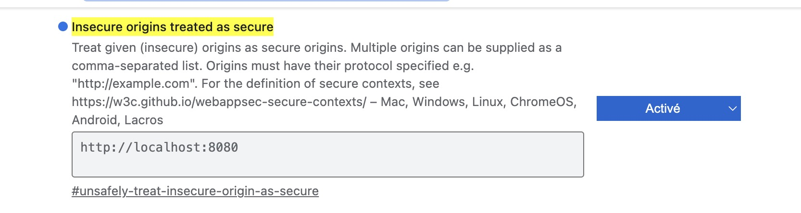

<h2>L'ultime Bot pour Don Quijote ou Don quixote ou Metamorphy...</h2>
<h3>Installation</h3>

  <ul>
    <li><code>install</code> pour installer python3.9 & l'environnement virtuel, sinon utiliser le fichier <code>requirements.txt</code></li>
    <li><code>start Editor</code> pour démarrer l'éditeur</li>
    <li><code>start Bot</code> pour démarrer le bot</li>
  </ul>

<h3>Utilisation du microphone</h3>

  Google va utiliser le microphone par défaut de l'ordinateur, à condigurer dans les préférences système, ainsi que le volume du microphone.
  Il faut autoriser google à utliser le micro :  
  Ouvrir le lien ci-dessous dans chrome :  <code>chrome://flags/#unsafely-treat-insecure-origin-as-secure</code> 
  Et activer <code>Insecure origins treated as secure</code> 
  </img>

<h3>Scripts</h3>

  Pour utiliser les scripts <code>ps1</code>, il faut installer <a href='https://learn.microsoft.com/fr-fr/powershell/scripting/install/installing-  powershell-on-macos?view=powershell-7.4#installation-via-direct-download' target='_blank'>powershell</a>. Ça fait la même chose que les scripts shell mais en associant l'extension ps1 avec le terminal (toujours ouvrir avec...), on peut double-cliquer dessus pour démarrer. 
  Et surtout pour le bot où il y a des couleurs c'est plus pratique pour comprendre ce qu'il se passe. 
Et surtout pour l'ordi sous XP c'est nécessaire.  

<h3>Données</h3>

  <ul>
    <li>Dans le répertoire <code>data</code>, se trouvent les différents projets. Le Fichier <code>default.json</code> est le fichier chargé au démarrage. Dans l'éditeur, en cliquant sur <code>paramètres</code> puis <code>load project</code>, on peut écraser ce fichier avec un des autres json ou faire un <code>save as...</code> du projet en cours.</li>
    <li>Dans le répertoire <code>sounds</code>, il faut déposer les sons (à télécharger séparément)</li>
    <li>Dans le répertoire <code>secret</code>, il faut déposer les clés d'api (à télécharger séparément)</li>
    <li>Dans le répertoire <code>logs</code>, se trouvent les conversations enregistrées</li>
  </ul>

<h3>Notes</h3>

  <i>Pour l'instant on utilise toujours google pour STT et TTS</i>

